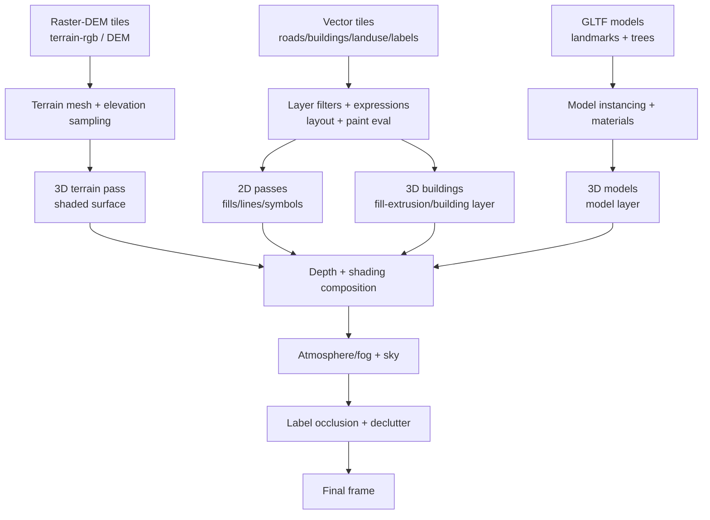

# Replicating Mapbox Standard 3D Visual Effects in MapLibre GL JS

## Executive summary

Mapbox’s “Standard” basemap delivers a coherent 3D “scene” through tight integration of (a) specialized style configuration knobs (themes, light presets, visibility toggles), (b) newer style-spec layer types and properties (notably `model`, `building`, `clip`, and `slot`, plus shadowing / ambient-occlusion controls), and (c) curated asset pipelines (vector tiles, DEM, and 3D model inventories for landmarks/trees). citeturn8view2turn8view0turn9view0turn11view4turn20view0

When targeting a MapLibre GL JS stylesheet, you can reproduce most of the *perceived* Standard look—3D buildings, terrain, vegetation “mass,” atmospheric depth cues, and crisp label hierarchies—by combining standard MapLibre Style Spec capabilities (`fill-extrusion`, `terrain`, `hillshade`, `sky`, symbol placement controls) with one or more **custom WebGL layers** for the “missing” features (notably shadows, ambient occlusion, and true 3D model instancing). citeturn3view0turn4view0turn4view1turn0search12turn14search0turn22view0

Key feasibility points:

- Standard’s *built-in* 3D objects include extruded buildings with advanced lighting effects, landmark 3D models, instanced tree models, and terrain; it also exposes global configuration toggles like `show3dObjects`, `show3dTrees`, and `lightPreset`, plus theme and color-override controls. citeturn8view2turn8view0turn8view3
- Mapbox can apply 3D occlusion to selectively hide/dim labels behind 3D objects, and it highlights smoother 3D building fade behavior and a `clip` layer type for removing 3D content in custom polygons—capabilities you must approximate manually in MapLibre. citeturn20view0turn9view0
- MapLibre’s strengths are (1) compatibility with Mapbox Vector Tiles encoding, (2) first-class `terrain` with `raster-dem` sources (including both “mapbox terrain-rgb” and “terrarium” encodings), and (3) extensibility via `CustomLayerInterface` to run your own WebGL programs (including Three.js) in the same context as the map. citeturn13view0turn4view0turn0search12turn22view0
- For shadows/AO, you can either implement classic shadow mapping inside a custom 3D layer (Three.js example provided by MapLibre) or use “planar” techniques purpose-built for extruded buildings, such as the AO+shadow custom-layer approach demonstrated by the community “AOShadowLayer” project. citeturn27view0turn14search0turn14search4

## Visual feature anatomy of Mapbox Standard

Mapbox Standard’s 3D look is the sum of multiple tightly coupled visual systems, many of which have direct Style Spec hooks, while others are delivered as higher-level “configuration properties” instead of editable layers. citeturn8view2turn8view0

### 3D buildings and extrusions

Standard describes its “3D Environment” as including buildings “extruded with detailed lighting effects,” including facade details on buildings near landmarks. citeturn8view2 In practice, the “Standard” stack mixes traditional extrusions with newer 3D building/asset handling (see the separate `building` and `model` layer types in the Mapbox Style Spec). citeturn9view0turn11view4

Mapbox’s Style Spec now includes experimental extrusion refinements such as rounded edges (`fill-extrusion-edge-radius`) and per-layer shadow-control toggles (`fill-extrusion-cast-shadows`). citeturn10view1turn10view3

### Trees and vegetation

Standard explicitly lists “Trees – 3D tree models with realistic scaling.” citeturn8view2 The Mapbox Style Spec says `model` layers can render “instanced models (for example, trees in standard style)” and that trees can be driven from vector/GeoJSON sources. citeturn11view4

### Terrain, shading, and atmosphere cues

Standard lists “Terrain – Elevation data to create natural landscapes.” citeturn8view2 In Mapbox’s style system, terrain is a global style modifier based on a DEM source (`terrain: { source, exaggeration }`). citeturn5search14

For atmospheric depth, Mapbox provides `fog` as a global style effect; Mapbox notes fog can improve depth perception and can “boost performance by reducing the number of tiles loaded in the distance.” citeturn21search9

### Lighting, materials, shadows, ambient occlusion, and emissive behavior

Standard advertises “Dynamic Lighting Capabilities,” and it provides four time-of-day “light presets” (`dawn`, `day`, `dusk`, `night`). citeturn8view2turn8view0turn8view3

At the configuration level, `show3dObjects` is documented as toggling “all 3D objects (3D buildings, landmarks, trees, etc.) including shadows, ambient occlusion, and flood lights,” which is an important clue: Standard’s realism isn’t just geometry—it’s a bundle of post/lighting effects. citeturn8view0turn8view3

At the style-spec level, Mapbox exposes ambient occlusion controls for extrusions (`fill-extrusion-ambient-occlusion-*`) and mentions plausible AO intensities around ~0.3 for buildings. citeturn10view0turn11view1 Mapbox also exposes emissive strength for layers (e.g., `fill-extrusion-emissive-strength`), and the Standard guide explicitly tells you to set emissive strength on custom layers to integrate visually with Standard lighting. citeturn10view2turn8view2

For 3D model materials, Mapbox provides properties like `model-roughness` (with notes about batched models) and shadow receive/cast toggles for models. citeturn11view3turn11view4

### Labels, occlusion, and decluttering behaviors

Mapbox’s August 29, 2024 update highlights “Improved label placement” via a “3D occlusion feature” that recognizes whether labels are in front of or behind 3D models and hides/dims distant features to reduce clutter in pitched views. citeturn20view0

This is a major differentiator: Standard isn’t only “3D geometry,” it is “label logic aware of 3D occlusion,” which is not a baseline feature in the MapLibre Style Spec. citeturn20view0turn3view0

### Color palettes, theming, and layer ordering

Standard exposes multiple themes (`default`, `faded`, `monochrome`, plus `custom` via a LUT image) and many color override knobs (roads, water, greenspace, land use categories, labels). citeturn8view0

Layer ordering in Standard is not only the JSON layer array order. Mapbox supports “slots” and “imports” for modular styles; its “work with layers” guide notes that for globe/terrain rendering, GL JS may reorder/batch layers for performance, and that draped layers (fill/line/background/hillshade/raster) render first “underneath symbols” despite slot placement. citeturn8view2turn16search20turn9view0

image_group{"layout":"carousel","aspect_ratio":"16:9","query":["Mapbox Standard style 3D buildings night light preset screenshot","Mapbox Standard style 3D trees screenshot","MapLibre GL JS 3D terrain example screenshot","MapLibre GL JS 3D buildings fill extrusion screenshot"],"num_per_query":1}

## Under-the-hood techniques used by Mapbox Standard

### Style architecture: “configuration-first” plus newer style-spec primitives

Mapbox describes Standard as “modern” and “continuously improving,” designed to “reduce configuration complexity” by presetting many elements and pushing automatic style updates. citeturn8view1turn8view2

Instead of editing hundreds of layers directly, you frequently adjust Standard through configuration properties (e.g., `lightPreset`, `theme`, label visibility toggles), including running-time updates via `setConfigProperty`. citeturn8view2turn8view3turn5search22

Standard can also be imported into another style via `imports` with a `config` block, which is a distinct architectural idea vs. classic single-style JSON editing. citeturn8view2

### Data sources and asset stack

At the style-spec level, Mapbox sources include vector, raster, raster-dem, geojson, and also a `model` source type for `GLTF` models. citeturn12view0

Mapbox’s `model` layer can draw from:
1) vector or GeoJSON (used for trees in Standard),
2) a `model` source with individual GLTF models,
3) `batched-model` (used for landmark buildings in Standard). citeturn11view4

Terrain in Mapbox is driven by a DEM source referenced by the root `terrain` property. citeturn5search14

### Rendering pipeline: expressions → GPU state → specialized shaders

Mapbox’s style model is explicitly about: choose sources, define layers, and render in that order; the style spec distinguishes **layout** properties (affect geometry “layout steps”) from **paint** properties (affect per-frame styling with cheaper updates). citeturn5search17turn16search30turn9view0

For 3D, that pipeline fans out into specialized render paths:

- `fill-extrusion` shaders for vertical walls and roofs (with optional AO, flood lighting, and shadow casting). citeturn11view1turn10view0turn10view1  
- `model` shaders for GLTF content with material parameters (e.g., roughness, emissive strength) and shadow receive/cast toggles. citeturn11view4turn11view3  
- Terrain mesh generation + shader evaluation driven by the DEM and global lighting/fog. citeturn5search14turn21search9

### Ordering and compositing: slots, clipping, and reordering for performance

Mapbox layers can be assigned to a `slot` name; if the slot exists, it controls placement in the layer order. citeturn9view0

Additionally, Mapbox warns that during globe/terrain rendering it “aims to batch multiple layers together,” which can rearrange layers; draped layers render first underneath symbols regardless of `slot` positioning. citeturn16search20

Standard also leverages new “scene management” constructs such as a `clip` layer type that can remove `model` and `symbol` layers below it within a polygon, supporting workflows like “remove a basemap 3D model and replace with a custom model.” citeturn9view0turn20view0

### A compact flow of how Standard’s 3D scene fits together



This diagram is an abstraction, but it aligns with the Style Spec’s emphasis on source/layer ordering and with Mapbox’s explicit support for terrain, model layers, and fog as global effects. citeturn5search17turn11view4turn5search14turn21search9turn20view0

## MapLibre-compatible implementation patterns

This section is “action oriented”: for each Standard feature bucket, it outlines a MapLibre implementation option that (a) is style-spec compatible, and (b) calls out where you will need custom WebGL or third-party helpers.

### Basemap data foundations: vector tiles + building heights + vegetation hints

If your goal is “Standard-like,” your biggest determinant won’t be a single shader—it will be **data completeness**: building footprints with reasonable heights, landcover/landuse polygons for greenspaces/forests, and POI/labels with good hierarchy. OpenMapTiles-derived schemas are widely used for this purpose. citeturn14search9turn14search1

For example, the OpenMapTiles schema exposes building “render_height” and “render_min_height,” plus flags like “hide_3d,” enabling consistent extrusions from OSM-derived data. citeturn14search5

If you don’t want to run a tile server, MapLibre supports custom protocols (via `addProtocol`) and has first-party examples of loading PMTiles archives, which can reduce operational cost and simplify deployment. citeturn18search2turn18search6turn18search3

### Buildings: MapLibre `fill-extrusion` as the core primitive

MapLibre’s Style Spec includes `fill-extrusion` for 3D extruded polygons. citeturn3view0turn22view1

#### Code example: extruding OpenMapTiles buildings with height/min-height and a “fade-in” illusion

The following snippet assumes a vector tileset with a `building` (or similar) source-layer containing `render_height` and `render_min_height` (OpenMapTiles-style attributes). citeturn14search5turn3view0

```js
map.on('load', () => {
  // Vector source uses MVT by default in MapLibre.
  map.addSource('basemap', {
    type: 'vector',
    url: 'https://your-tilejson.example.com/tiles.json'
  });

  // 3D buildings layer
  map.addLayer({
    id: 'buildings-3d',
    type: 'fill-extrusion',
    source: 'basemap',
    'source-layer': 'building',
    minzoom: 14,
    paint: {
      // “Standard-like” muted base tone that can be themed later.
      'fill-extrusion-color': [
        'interpolate',
        ['linear'],
        ['coalesce', ['to-number', ['get', 'render_height']], 0],
        0, '#d9d6cf',
        50, '#cfcac0',
        200, '#bfb8ab'
      ],

      // Approximate “smooth building fade” by scaling height with zoom.
      // At z=14.5 -> near 0, by z=16 -> full height.
      'fill-extrusion-height': [
        'interpolate', ['linear'], ['zoom'],
        14.5, 0,
        16.0, ['coalesce', ['to-number', ['get', 'render_height']], 0]
      ],
      'fill-extrusion-base': [
        'interpolate', ['linear'], ['zoom'],
        14.5, 0,
        16.0, ['coalesce', ['to-number', ['get', 'render_min_height']], 0]
      ],

      'fill-extrusion-opacity': 0.95,
      'fill-extrusion-vertical-gradient': true
    }
  });
});
```

This “zoom-driven height ramp” is not identical to Mapbox’s internal building fade/LOD system, but it reproduces the key perceptual cue: buildings “grow in” as you approach, reducing distant clutter. citeturn20view0turn3view0

#### What you will not get “for free” in MapLibre

Mapbox exposes extrusion ambient-occlusion and shadow toggles (`fill-extrusion-ambient-occlusion-*`, `fill-extrusion-cast-shadows`) and rounded edges (`fill-extrusion-edge-radius`). These are not part of the MapLibre Style Spec layer reference (which focuses on classic `fill-extrusion` and does not enumerate these newer experimental Mapbox properties). citeturn10view0turn10view1turn16search33

In MapLibre, you’ll approximate those effects via:

- AO/shadows as a custom layer (see below). citeturn14search0turn0search12  
- Edge rounding via geometry (tessellate/round during tile generation) or custom extrusion shading (advanced). citeturn10view3turn14search9

### Terrain: DEM sources, exaggeration, hillshade, and sky “fog”

MapLibre supports terrain as a root-level style property that elevates rendering based on a DEM source. citeturn7view0turn4view0

MapLibre’s `raster-dem` source supports both:
- **Mapbox Terrain RGB** encoding (`encoding: "mapbox"`)
- **Mapzen Terrarium** encoding (`encoding: "terrarium"`)
- plus a `custom` decoder in newer MapLibre GL JS versions. citeturn13view0

#### DEM decoding formulas you will likely need (for custom shaders and validation)

If you ingest Terrain-RGB tiles and decode heights manually (e.g., for custom hillshade, normals, or mesh displacement), Mapbox documents the Terrain-RGB decode equation:  
`elevation = -10000 + ((R * 256 * 256 + G * 256 + B) * 0.1)` (meters). citeturn28view0

For Terrarium tiles, Mapzen/Terrain Tiles documentation defines:  
`(red * 256 + green + blue / 256) - 32768` (meters). citeturn30view0

#### “Normal tiles” as a shortcut to terrain lighting realism

The same Mapzen terrain docs also describe a “normal” tile format where RGB encodes the surface normal vector (XYZ direction) and alpha stores a quantized elevation banding. This can be used to get high-quality lighting without computing normals in your shader from a heightmap each frame. citeturn30view0

#### Code example: enabling terrain + hillshade + sky/fog cues in MapLibre

MapLibre’s examples show configuring `raster-dem`, setting terrain, and optionally adding hillshade and sky. citeturn23view0turn23view1turn13view0turn4view1

```js
map.on('load', () => {
  map.addSource('dem', {
    type: 'raster-dem',
    tiles: ['https://your-dem-tiles/{z}/{x}/{y}.png'],
    tileSize: 256,
    encoding: 'terrarium' // or 'mapbox'
  });

  // Elevate the scene
  map.setTerrain({ source: 'dem', exaggeration: 1.2 });

  // Add hillshade for micro-relief (still valuable even with true terrain)
  map.addLayer({
    id: 'terrain-hillshade',
    type: 'hillshade',
    source: 'dem',
    paint: {
      'hillshade-exaggeration': 0.4
    }
  });

  // Sky/fog controls live under the Style Spec 'sky' in MapLibre.
  // (The MapLibre Style Spec notes sky is still experimental.)
  map.setSky({
    'sky-color': '#7aa7ff',
    'horizon-color': '#ffffff',
    'fog-color': '#cfd8e6',
    'sky-horizon-blend': 0.6,
    'horizon-fog-blend': 0.8,
    'fog-ground-blend': 0.5
  });
});
```

MapLibre’s “sky/fog/terrain” example emphasizes these sky/fog blend parameters and shows them as runtime-adjustable controls. citeturn23view1turn4view1

#### Terrain lighting GLSL snippet (custom layer approach)

If you need Standard-like dramatic terrain lighting beyond hillshade/sky, you can render a terrain mesh in a custom layer and light it yourself. MapLibre exposes `createTileMesh()` which generates a subdivided quad mesh for a tile and is intended for raster/hillshade use cases, providing typed arrays for vertices/indices. citeturn25view0

A minimal fragment shader pattern (Lambert + optional “wrap lighting”) for a heightfield where you compute normals from sampled heights:

```glsl
// PSEUDOCODE: terrain lighting fragment shader
precision highp float;

uniform sampler2D uHeightTex;   // DEM as texture
uniform vec2 uTexelSize;        // 1.0 / textureResolution
uniform vec3 uLightDir;         // normalized, in tile/local space
uniform vec3 uAlbedo;

float heightAt(vec2 uv) {
  // Assumes you've decoded DEM into a linear height texture already.
  return texture2D(uHeightTex, uv).r;
}

vec3 normalFromHeight(vec2 uv) {
  float hL = heightAt(uv - vec2(uTexelSize.x, 0.0));
  float hR = heightAt(uv + vec2(uTexelSize.x, 0.0));
  float hD = heightAt(uv - vec2(0.0, uTexelSize.y));
  float hU = heightAt(uv + vec2(0.0, uTexelSize.y));

  // Scale factor depends on meters-per-texel at this zoom/tile.
  vec3 n = normalize(vec3(hL - hR, hD - hU, 2.0));
  return n;
}

void main() {
  vec2 uv = /* your interpolated DEM UV */;
  vec3 n = normalFromHeight(uv);
  float ndl = max(dot(n, uLightDir), 0.0);

  // Wrap lighting to avoid “crushed” dark sides (cartographic choice)
  float wrap = 0.35;
  float diffuse = clamp((ndl + wrap) / (1.0 + wrap), 0.0, 1.0);

  vec3 color = uAlbedo * diffuse;
  gl_FragColor = vec4(color, 1.0);
}
```

You would pair this with a mesh generation strategy (e.g., `createTileMesh()` plus per-vertex elevation displacement) and a DEM decode step, using the documented “mapbox” or “terrarium” formulas for correctness checks. citeturn25view0turn28view0turn30view0

### Trees and vegetation: from billboards to instanced glTF

Because MapLibre doesn’t have Mapbox’s `model` layer type, you have two primary strategies:

1) **Billboard symbols**: fast, easy, very MapLibre-native.  
2) **Custom 3D layer (Three.js) with instancing**: closer to Standard’s look, more engineering effort.

#### Strategy A: billboard trees via `symbol` layers

MapLibre symbol layers provide collision behavior, ordering controls (`symbol-sort-key`, `symbol-z-order`), and variable anchor placement utilities that help manage clutter. citeturn15view1turn15view2turn15view3

A Standard-like baseline is:

- Use a point layer of trees (from your tileset or derived from landcover polygons).
- Render with a small sprite atlas (texture atlasing reduces draw calls and texture binds). citeturn16search2turn15view1
- Use `icon-size` interpolation by zoom and `symbol-sort-key` to draw closer/larger trees “over” smaller ones.

```js
map.addLayer({
  id: 'trees-billboard',
  type: 'symbol',
  source: 'basemap',
  'source-layer': 'poi', // or a dedicated trees layer
  filter: ['==', ['get', 'class'], 'tree'],
  minzoom: 14,
  layout: {
    'icon-image': 'tree-sprite',
    'icon-size': [
      'interpolate', ['linear'], ['zoom'],
      14, 0.4,
      18, 1.2
    ],
    'icon-allow-overlap': false,
    'icon-ignore-placement': false,
    'symbol-z-order': 'viewport-y',
    'symbol-sort-key': ['coalesce', ['to-number', ['get', 'priority']], 0]
  }
});
```

This does not create true parallax or trunk/canopy shading, but it often gets you 70–80% of the “vegetation presence” at a fraction of the cost.

#### Strategy B: instanced glTF trees in a custom layer

MapLibre provides documented examples of loading glTF via Three.js inside a `CustomLayerInterface` and sharing MapLibre’s WebGL canvas/context with the Three.js renderer. citeturn22view0turn0search12

MapLibre also provides a Three.js shadow example (directional light + shadow map) that demonstrates the overall integration pattern. citeturn27view0

A scalable approach for “Standard-like forests” is:

- Use a *single* low-poly tree glTF (or a small set of variants).
- Create an instanced mesh (Three.js `InstancedMesh`) for per-tile batches.
- Position instances using tile feature coordinates, and sample terrain elevation (either by precomputing heights server-side, or by using terrain queries / sampling/approximations).

Mapbox’s Standard uses vector/GeoJSON-driven instances for trees in its `model` layer, so conceptually this is aligned—even if the implementation differs. citeturn11view4turn8view2

### Shadows and ambient occlusion: three implementation tiers in MapLibre

Mapbox exposes extrusion AO parameters and shadow toggles directly in style properties, but MapLibre requires custom rendering for comparable effects. citeturn10view0turn10view1turn16search33

You can choose among three tiers:

#### Tier 1: “Planar grounding” optimized for 3D buildings (recommended baseline)

The community “AOShadowLayer” project targets exactly the “hovering paper-cutout” problem of extrusions, using two planar techniques: SDF-based ambient occlusion and projected footprint shadows, implemented as a single `CustomLayerInterface` with multiple GPU passes and a screen composite—no shadow maps or extra cameras. citeturn14search0turn14search4turn0search12

This matches many map use cases because building shadows on maps are often intended as *contact cues*, not physically perfect global illumination.

#### Tier 2: Shadow mapping inside a Three.js custom layer (good for landmarks / custom 3D models)

MapLibre’s own “3D model with shadow using three.js” example shows shadow mapping via a `DirectionalLight` with `castShadow`, a shadow-receiving ground plane (`ShadowMaterial`), enabling the renderer shadow map, and using PCF soft shadows. citeturn27view0

This is appropriate when you have a small number of high-value models (iconic landmarks, a campus building model set) rather than millions of trees/buildings.

#### Tier 3: Full deferred/SSAO pipelines (heaviest; only if you truly need it)

If you want Standard-like AO that responds to complex occluding geometry at screen scale, classic screen-space AO (SSAO) techniques exist, but they typically require depth textures and heavier post-processing. The NVIDIA SSAO whitepaper and later research (e.g., McGuire’s Alchemy AO) highlight the realism and cost trade-offs of screen-space AO approaches. citeturn16search22turn16search36

Practically: in MapLibre, this usually means rendering geometry into offscreen framebuffers, then running AO as a post pass. It can be done, but it’s rarely the best ROI for maps unless you are building a “3D city viewer” product.

### Label placement: what you can replicate, and what you can only approximate

Mapbox Standard’s 3D occlusion selectively hides or fades labels behind 3D models and also adjusts road label behavior for pitched views. citeturn20view0

MapLibre gives you strong 2D label-placement tools:

- `text-variable-anchor` / `text-variable-anchor-offset` to try multiple placements for a label, improving placement success. citeturn15view3  
- Collision and overlap controls (`text-allow-overlap`, `text-overlap`) and symbol ordering (`symbol-sort-key`, `symbol-z-order`). citeturn15view1turn15view2

But MapLibre does **not** expose a native “occlude labels behind 3D buildings” system comparable to what Mapbox describes, so your options are approximations:

- Reduce clutter in pitch views by dynamically lowering label density as pitch increases (swap styles or toggle layers).
- Use `symbol-sort-key` and hierarchy to keep high-priority labels visible.
- For road shields/labels, allow limited overlap or set higher sort-keys for roads to mimic “roads on top” behavior (accepting that it won’t be true depth-aware occlusion). citeturn15view1turn15view2turn20view0

### The Mapbox vs MapLibre property-equivalence table

The table below focuses on properties and concepts called out in your request (3D extrusions, terrain, shadows/AO, lighting, materials, labels, ordering, transitions). It intentionally separates **direct equivalents** from **requires custom layer** and **not available**.

(References for Mapbox properties come from the Mapbox Style Spec and Standard API; MapLibre support is from the MapLibre Style Spec and examples.) citeturn8view0turn11view1turn11view4turn13view0turn7view0turn4view0turn3view0turn15view3turn16search20

| Feature / property concept | Mapbox (Standard + Style Spec) | MapLibre (Style Spec / API) | Practical MapLibre approach |
|---|---|---|---|
| 3D buildings | `building` layer type; also `fill-extrusion` | `fill-extrusion` | Use `fill-extrusion` with height/min-height attributes (e.g., OpenMapTiles `render_height`) |
| Extrusion rounded edges | `fill-extrusion-edge-radius` (experimental) | Not in MapLibre layer list | Pre-round geometry in tiles, or custom extrusion rendering |
| Extrusion AO | `fill-extrusion-ambient-occlusion-*` | Not native | Custom layer (planar AO like AOShadowLayer) or SSAO pipeline |
| Extrusion shadows | `fill-extrusion-cast-shadows` | Not native | Planar shadow projection (AOShadowLayer) or custom shadow maps |
| 3D trees | `model` layer with vector/GeoJSON instancing | No `model` layer | Symbol billboards or custom layer instanced glTF |
| 3D landmarks | `model` layer + `batched-model` sources | No `model` layer | Custom layer + glTF (Three.js) |
| Terrain | root `terrain` (DEM source + exaggeration) | root `terrain` (DEM source + exaggeration) | Direct: `raster-dem` + `setTerrain` |
| Fog / atmosphere | root `fog` global effect | `sky` with fog/horizon blend params | Use `setSky` and tune fog colors/blends |
| Lighting | Standard `lightPreset` and style-spec lighting; newer “lights required” properties | root `light` (single global light) | Animate root light + palette changes; keep expectations realistic |
| Materials (roughness/emissive) | `model-roughness`, `model-emissive-strength`, etc. | Not native | Handle in Three.js (PBR) or custom shaders |
| Label occlusion behind 3D | Standard 3D occlusion feature | Not native | Approximate with symbol ordering/density logic; no true depth-occlusion |
| Layer ordering system | `imports`, `slots`, performance reordering | Classic layer order array | Use explicit layer order; keep draped layers below symbols manually |
| Transitions | paint transitions; Standard “smooth building fade” behavior | root `transition` + paint transitions | Use root `transition` and zoom-driven interpolations |

## Performance, memory, and quality trade-offs

### A practical performance model for your build

Even if you don’t match Standard’s internals, you will run into similar constraints: render time rises with (1) sources, (2) layers, and (3) vertex count. Mapbox’s performance troubleshooting guide explicitly frames render time as a function of these terms and recommends reducing layers/sources/feature complexity. citeturn16search1

MapLibre provides its own “large data” guidance (focused on GeoJSON), emphasizing load strategy and visualization strategy—especially important if you’re tempted to drive trees/buildings from large client-side GeoJSON. citeturn16search0

### Key cost drivers for “Standard-like 3D” in MapLibre

**3D buildings (`fill-extrusion`)**  
- Cost drivers: footprint density, vertex count from polygon complexity, and overdraw in dense downtowns.  
- Optimization: simplify building geometries at lower zooms (tile-generation), avoid rendering tiny buildings at far zooms, and ramp-in heights to reduce clutter (the “fade/grow” trick). citeturn16search1turn20view0turn14search9

**Vegetation**  
- Billboard symbols are typically cheaper than true 3D models, but symbol collision and overlap can be CPU-heavy; MapLibre issues show performance problems with many overlapping symbols when overlap is allowed. citeturn16search4turn15view1  
- Instanced meshes are GPU-friendly but still increase fill-rate and shader cost; keep variants small and use instancing per tile.

**Shadows/AO**  
- Shadow mapping scales poorly if you attempt it for “everything” (many objects → large shadow maps, multiple passes). Use it for landmarks, not for every building/tree. citeturn27view0  
- Planar AO + footprint shadows are a strong compromise for buildings (high perceived realism per GPU cost). citeturn14search0turn14search4

**Textures and sprites**  
- Texture atlasing reduces draw-call splitting caused by texture changes; this is a standard WebGL best practice. citeturn16search2  
- Prefer compressed textures (KTX2 / Basis Universal) for custom 3D assets when you control the pipeline; KTX 2.0 is designed as a GPU texture container and supports Basis Universal supercompression. citeturn18search1turn18search9

### Instrumentation and regression testing

MapLibre provides an example for displaying map performance metrics via built-in events; use it to establish baselines before/after adding each major 3D effect. citeturn16search12

A pragmatic testing checklist (keep it lightweight but consistent):

- Visual regression: compare screenshots across zoom/pitch/bearing “stations” (downtown, suburbs, mountains, coastline).  
- Stress: maximum pitch + high zoom in dense building zones (worst-case overdraw).  
- Label density: measure FPS while toggling text overlap modes; avoid blanket `text-allow-overlap: true` in high-density POI layers. citeturn16search4turn15view1  
- Memory: watch texture atlas growth (sprites + glyphs + custom 3D textures).  
- Tile/network: confirm caching behavior and request waterfall; consider single-file archives (PMTiles) when operational simplicity matters. citeturn18search6turn18search3

## Licensing, attribution, and do-not-copy guidance

### What not to copy from Mapbox Standard

Mapbox Standard is delivered via Mapbox style URLs and governed by Mapbox’s service terms; avoid copying proprietary style JSON fragments, sprite sheets, glyph packs, and especially Mapbox’s curated 3D landmark/tree model inventories. citeturn8view2turn17search2

Even where a *concept* is general (e.g., “trees are instanced models from vector points”), the *asset pack and styling choices* in Standard are part of Mapbox’s product. Recreate the aesthetic using open data + your own artistic decisions rather than cloning Standard’s exact layers/assets. citeturn8view2turn11view4turn17search2

### Attribution requirements for an open alternative stack

If you build on OpenStreetMap-derived data, you must follow the attribution requirements. The entity["organization","OpenStreetMap Foundation","osm licensing body"] states attribution must be visible to anyone exposed to the produced work, placed where users expect it, and legible. citeturn17search0

If you use entity["organization","OpenMapTiles","vector tile schema"] schema/tiles, their docs explicitly note the schema is open source (BSD + CC-BY) and that you must still attribute OpenStreetMap and the OpenMapTiles project itself. citeturn17search8turn17search1

### Recommended open assets and formats for a “Standard-like” build

**Vector tiles (streets/buildings/landuse/labels)**  
- OpenMapTiles-based tilesets are a common path (self-hosted or hosted providers). citeturn14search9turn14search6  
- Store-and-serve option: PMTiles (single-file tile archive) integrates cleanly with MapLibre via `addProtocol` and has an official MapLibre example. citeturn18search6turn18search2turn18search3

**Terrain / DEM**  
- Terrarium DEM tiles are available via the AWS Terrain Tiles registry, managed by Mapzen (Linux Foundation project) and documented alongside formats and decoding. citeturn28view1turn30view0  
- If you use “mapbox terrain-rgb” encoding from a provider, validate decoding with the documented formula. citeturn28view0turn13view0

**3D models + materials**  
- Use glTF 2.0 (`.gltf` / `.glb`) as your interchange/runtime asset format; the Khronos spec positions glTF as an efficient “runtime asset delivery format.” citeturn18search0turn22view0  
- For textures, prefer KTX2 when possible to reduce download size and GPU memory; KTX 2.0 is designed for GPU-ready textures and supports Basis Universal supercompression. citeturn18search1turn18search9

**Open 3D vegetation assets (permissive licensing)**  
- entity["organization","Poly Haven","cc0 asset library"] provides CC0 textures/HDRIs/models suitable for commercial work. citeturn19search0turn19search12  
- entity["company","Kenney","game asset publisher"] offers a “Nature Kit” under CC0, including trees/foliage models. citeturn19search1

**Fonts / glyphs**  
- Google Fonts FAQ notes most fonts are under the SIL Open Font License (OFL) and can be used commercially under the license terms. citeturn19search7turn19search19  
- The Noto fonts project is licensed under OFL 1.1 (verify and bundle license text as required if you redistribute). citeturn19search11turn19search15

### MapLibre licensing

entity["organization","MapLibre","open-source mapping project"] GL JS is distributed under a BSD 3-clause license (as indicated by its license file and package metadata). citeturn17search3turn17search34

## Implementation checklist, migration plan, and testing

### Concise implementation checklist and migration plan

The fastest path to a Standard-like result is to treat it as a staged migration (so you can quantify cost/benefit at each step).

**Phase 1: Data + 2D cartographic baseline**
- Choose your basemap tileset (OpenMapTiles schema or similar) and confirm building height attributes exist (e.g., `render_height`, `render_min_height`). citeturn14search5turn14search9  
- Start from an open style (e.g., OSM Bright) and establish a 2D palette / label hierarchy baseline. citeturn14search2turn14search6  
- Lock down attribution UI early (OSM + OpenMapTiles if applicable). citeturn17search0turn17search8

**Phase 2: 3D buildings**
- Add `fill-extrusion` buildings at `minzoom` ~14–15. citeturn3view0turn22view1  
- Implement “fade/grow” as zoom-driven height/base interpolation for declutter and perceived smoothness (closest analog to Standard’s “smooth building fade”). citeturn20view0

**Phase 3: Terrain + atmosphere**
- Add `raster-dem` (`terrarium` or `mapbox` encoding) and enable root `terrain` exaggeration. citeturn13view0turn4view0turn23view0  
- Add hillshade and/or use “normal tiles” if you want stronger lighting cues. citeturn30view0turn23view0  
- Add `sky` configuration for fog/horizon blending. citeturn4view1turn23view1

**Phase 4: Vegetation**
- Start with billboard trees (symbol layer) for coverage. citeturn15view1  
- Upgrade hotspots (parks, downtown boulevards) to instanced glTF trees via a custom Three.js layer if needed. citeturn22view0turn0search12

**Phase 5: Shadows and AO**
- Add planar AO+shadow custom layer for buildings (high ROI). citeturn14search0turn14search4  
- Use shadow mapping only for landmark/campus models where it matters (MapLibre’s Three.js shadow example is a direct template). citeturn27view0

**Phase 6: “Polish pass”**
- Re-tune label hierarchy for pitch views using `symbol-sort-key`, `symbol-z-order`, and variable anchors; accept that true 3D label occlusion is not native. citeturn15view2turn15view3turn20view0  
- Introduce theming with a controlled palette system (style variants or runtime paint-property updates); MapLibre supports root `transition` configuration for style changes. citeturn4view2turn7view0

### Code examples and templates for your four requested “key features”

**Building extrusions:** See the `fill-extrusion` example above; MapLibre also provides a full working example extruding indoor polygons from GeoJSON using `fill-extrusion-color`, `fill-extrusion-height`, and `fill-extrusion-base`. citeturn22view1

**Tree billboards / 3D models:** Start with `symbol` billboards; then adopt MapLibre’s “Adding 3D models using three.js on terrain” example for custom layers sharing the map’s WebGL context. citeturn15view1turn22view0turn0search12

**Shadowing / ambient occlusion:** Use AOShadowLayer for planar building grounding or MapLibre’s Three.js shadow example for a few models. citeturn14search0turn27view0

**Terrain lighting:** Use `terrain` + hillshade as baseline; if you need more, consider custom mesh rendering using `createTileMesh()` and DEM decoding formulas for your own shading. citeturn25view0turn28view0turn30view0turn23view0

### Performance tuning tips and a testing checklist

- Keep layer counts reasonable; merge layers when they differ only trivially (Mapbox’s general guidance applies equally to MapLibre’s renderer cost structure). citeturn16search1  
- Prefer vector tiles over massive GeoJSON overlays; MapLibre’s large-data guide exists for a reason. citeturn16search0  
- Treat overlapping symbol fields as a performance risk; avoid broad overlap in dense POI layers. citeturn16search4turn15view1  
- Atlas textures and keep sprite sheets compact to reduce texture binds and draw-call splits. citeturn16search2  
- Add performance telemetry early (MapLibre performance metrics example) and set explicit FPS targets per device class. citeturn16search12

### Monetization opportunities based on this work

A Standard-like “premium 3D basemap” for MapLibre is marketable because many teams want the “high-end 3D feel” without adopting Mapbox’s managed style ecosystem. A few concrete ways to turn this into revenue:

- Sell “Standard-like MapLibre style kits” (day/night palettes + label hierarchy + 3D building presets) bundled with documentation and attribution templates. citeturn8view0turn4view2turn17search0  
- Offer implementation services for “3D upgrades” (terrain + buildings + vegetation + shadows) with a measurable performance budget and regression suite. citeturn16search12turn16search1  
- Build and maintain a polished “building grounding” plugin package (planar AO + footprint shadows) as a premium support offering, similar in concept to the AOShadowLayer approach. citeturn14search0turn14search4